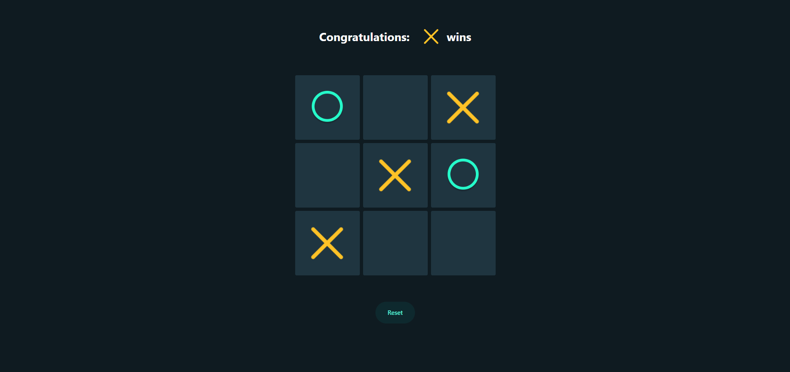

# Tic Tac Toe in React 🎮

This project is a **Tic Tac Toe** game built using **React**. It features a simple, interactive UI that allows two players to take turns and play the game. The game includes the ability to reset and detect a win condition. It is fully responsive and stylized with **Tailwind CSS**.

## 🚀 Live Demo

You can view and play the live version of the Tic Tac Toe game [here](https://kirtanpatel01.github.io/ARKA_WD_03/).

## 📂 Project Overview

**Tic Tac Toe** is a turn-based game where two players, `X` and `O`, alternate marking spaces on a 3x3 grid. The player who succeeds in placing three of their marks in a horizontal, vertical, or diagonal row wins the game.

### Features

- **Interactive Gameplay**: Click to place an `X` or `O` in the grid.
- **Win Detection**: The game checks for a win condition and declares the winner.
- **Reset Option**: Easily reset the game to start over.
- **Responsive Design**: Works well on different screen sizes.
- **Dynamic Styling**: Tailwind CSS used for the responsive and interactive UI elements.

## 🛠️ Technologies Used

- **React**: JavaScript library for building user interfaces.
- **Tailwind CSS**: Utility-first CSS framework for styling.
- **JavaScript (ES6)**: Game logic implementation.
- **HTML5/CSS3**: For structure and layout.

## 📦 Installation

To run this project locally, follow these steps:

1. Clone the repository:

    ```bash
    git clone https://github.com/kirtanpatel01/ARKA_WD_03.git
    ```

2. Navigate to the project folder:

    ```bash
    cd ARKA_WD_03
    ```

3. Install the dependencies:

    ```bash
    npm install
    ```

4. Start the development server:

    ```bash
    npm run dev
    ```

5. Open `http://localhost:5137` in your browser to play the game.

## 💡 Usage

- **To play**: Click on any empty box to place your symbol (`X` or `O`).
- **To win**: Get three of your symbols in a row, column, or diagonal.
- **Reset**: Click the "Reset" button to restart the game.

## 📸 Screenshots



## 🧠 How It Works

- **Game Logic**: Alternates between players `X` and `O`. After each move, the game checks for a winner by comparing the current grid state against winning combinations.
- **Winning Combinations**: Horizontal, vertical, and diagonal lines are checked after each move.
- **Lock State**: Once a player wins, the game board locks, preventing further moves.

## 🔧 Development

Want to improve the game? Feel free to contribute! Fork this repository, make your changes, and submit a pull request.

## 🤝 Contributing

1. Fork the repository.
2. Create a new feature branch (`git checkout -b feature/your-feature`).
3. Commit your changes (`git commit -m 'Add new feature'`).
4. Push the branch (`git push origin feature/your-feature`).
5. Open a pull request.
